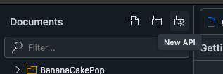

# Schema Evolution

## Introduction

In a distributed system, **subgraphs** represent **bounded contexts**, and these bounded contexts are often maintained by different teams. As the overall schema evolves, it’s crucial to validate the integrity of the entire schema to ensure that no **breaking changes** are introduced that could negatively impact other parts of the system.

## Creating an API

To get started, log into **Nitro** and either create a new organization or use an existing one.

1. **Create a New API**: 
   - Name the API `Schema Evolution`.
   
   

2. **API Gateway Configuration**:
   - Select the API Gateway configuration option.
   
   

## Creating an API Key

You’ll need an API key to interact with Nitro via the CLI. Follow these steps to create one:

1. **Install the Nitro CLI** by running the following command:
   ```bash
   dotnet tool install -g ChilliCream.Nitro.CLI
   ```

2. **Create an API Key** by running the following command:
   ```bash
   nitro api-key create
   ```

3. **Copy the Secret Value**:
   ```bash
   ? For which api do you want to create a api key?: QXBpCmdjZjIwMGQxZjM0OTQ0ZjVkYjVmODVhY2E2OTk1ZGJjNQ==
   ? Name Demo 
   ✓ Secret: N3wzBUlGLpfZtF9RoJPa38GSG6ympAbzdXrznDNa0LgB3alaqWfQB7iDtv41o4fk
   ```
   *Note: This secret will not be available later, so make sure to save it.*

## Configuring Your Gateway

1. **Add Nitro to Your Gateway Project**:
   ```bash
   dotnet add package ChilliCream.Nitro.Fusion
   ```

2. **Copy the API ID** from the "Overview" tab in Nitro.

3. **Configure the Gateway from the Cloud**:
   Instead of configuring from a file, we will configure the gateway from the cloud. Add the following configuration to your gateway:

   ```csharp
   builder.Services
       .AddFusionGatewayServer()
       .ConfigureFromCloud(x =>
       {
           x.Stage = "dev";
           x.ApiId = "QXBpCmc2MTZmMGFkMjU2ZDQ0Y2ZkYjE5NDI5YTE2M2JkMjI4Nw==";
           x.ApiKey = "N3wzBUlGLpfZtF9RoJPa38GSG6ympAbzdXrznDNa0LgB3alaqWfQB7iDtv41o4fk";
       });
   ```

## Publishing a Fusion Configuration

Publishing a fusion configuration is a multi-step process. Follow these steps:

### Step 1: Request a Deployment Slot
Before deploying a subgraph, you must request a deployment slot:
```bash
nitro fusion-configuration publish begin --api-id QXBpCmc2MTZmMGFkMjU2ZDQ0Y2ZkYjE5NDI5YTE2M2JkMjI4Nw== --tag 0.1.0 --stage dev --subgraph-name basket
```

### Step 2: Start the Deployment
Once a slot is available, you need to start the deployment to confirm that you are ready to proceed. If you don't start it within 30 seconds, the deployment will be canceled:
```bash
nitro fusion-configuration publish start
```

### Step 3: Download and Compose the Configuration
Download the configuration using the following command:
```bash
nitro fusion-configuration download
```
In this demo, everything is done locally, so a `dotnet build` of the AppHost is sufficient to build the gateway. **In real scenarios, this step might differ depending on your release pipelines**.

### Step 4: Validate the Configuration
Before committing the configuration, validate it against the schema registry:
```bash
nitro fusion-configuration publish validate --configuration ../Gateway/gateway.fgp
```

### Step 5: Commit the Configuration
After successful validation, commit the configuration to the schema registry:
```bash
nitro fusion-configuration publish commit --configuration ../Gateway/gateway.fgp
```

You should now see the new deployment in Nitro. Go to the **Changelog** tab and click "Refresh" to view the updated configuration.

On the **Overview** tab, you’ll be able to see the deployed configuration, including all subgraphs.

## Tasks

1. **Publish the Fusion Configuration**: Follow the steps above to publish your fusion configuration to Nitro.
   
2. **Introduce a Breaking Change**: For example, try removing a field from a type in one of your subgraphs. What happens when you attempt to validate the configuration in the validation step?
